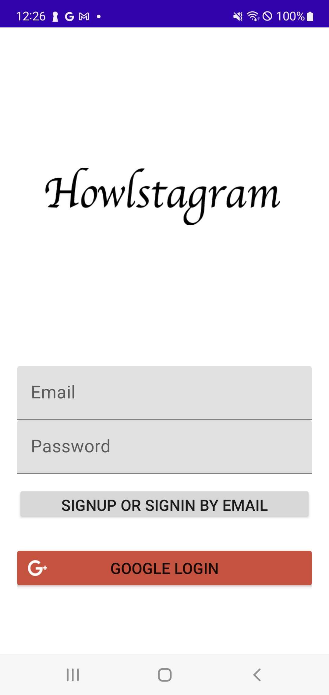
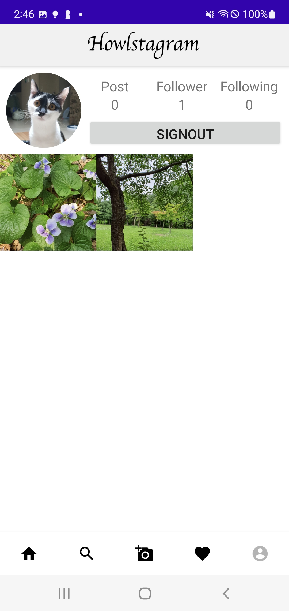

# instagram-clone
Instagram clone 프로젝트 

    
    
    

## 구현 요소
* CleanArchitecture | MVVM 
* Hilt, Coroutine(Flow), LiveData, DataBinding, Navigation 사용
* Firebase 사용
* layout xml 구현 시 ConstraintLayout, CoordinatorLayout 사용
* 로그인 한 계정 정보 화면(AccountFragment)과 글 목록에서 프로필 사진 눌러 이동하는 계정 정보 화면(ProfileViewFragment)을 분리
* 각종 NPE 처리
